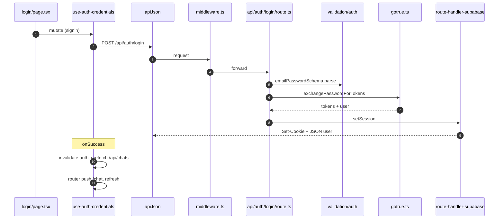
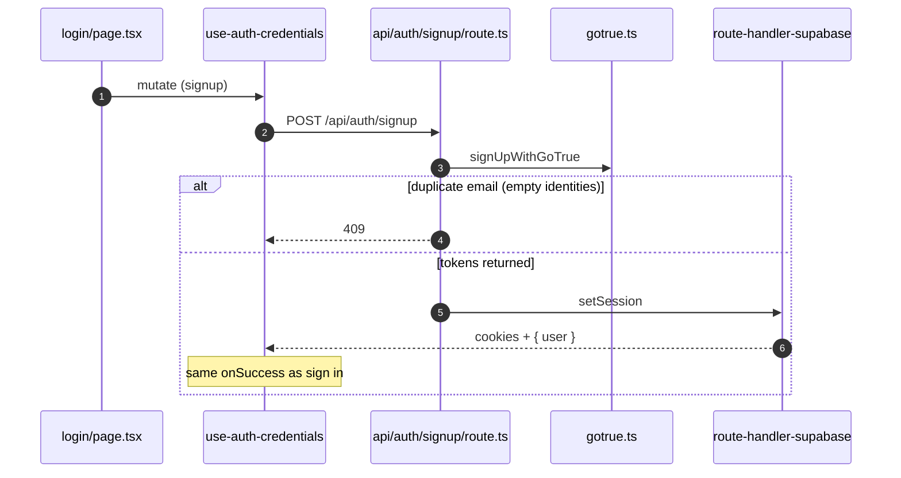
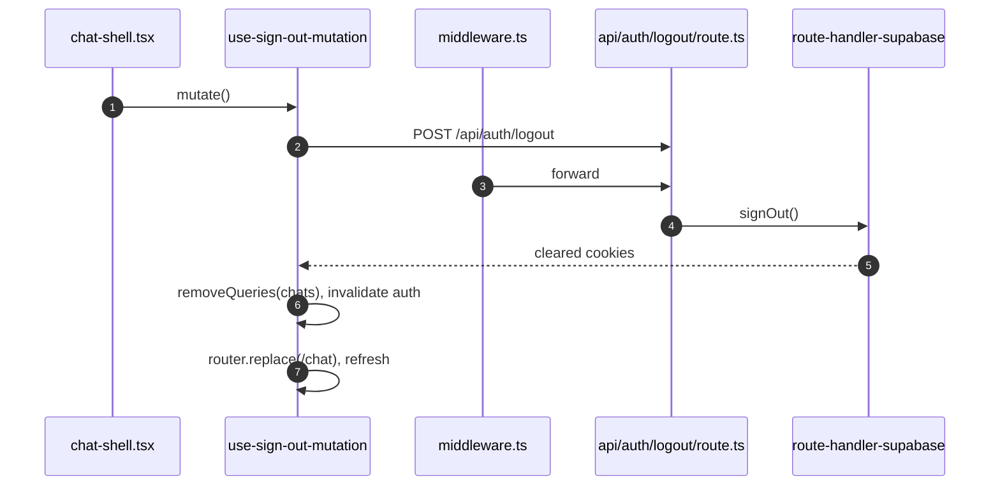

# Authentication

## Contents

- [Overview](#overview)
- [Environment](#environment)
- [Middleware](#middleware-srcmiddlewarets)
- [Server session helpers](#server-session-helpers)
- [GoTrue server calls](#gotrue-server-calls-srcserverauthgotruets)
- [HTTP API](#http-api)
- [Client](#client)
- [Protected APIs and profiles](#protected-apis-and-profiles)
- [Guest vs signed-in](#guest-vs-signed-in)
- [File sequences](#file-sequences)
- [Sequence diagrams (Mermaid)](#sequence-diagrams-mermaid)
- [Security notes](#security-notes)

---

## Overview

The app uses **Supabase Auth (GoTrue)** with **HTTP-only session cookies** managed by `@supabase/ssr`. Sign-in and sign-up are performed on the server using the **service role** (password grant and signup API). The returned tokens are written into the browser session via `supabase.auth.setSession()` in route handlers, matching a normal Supabase client session.

### High-level flow

1. **Login or signup** — The browser `POST`s email and password to `/api/auth/login` or `/api/auth/signup`.
2. **Token exchange** — The route handler calls GoTrue with the **service role** (`exchangePasswordForTokens` or `signUpWithGoTrue` in `src/server/auth/gotrue.ts`), receives access and refresh tokens plus the user object when a session is created.
3. **Cookie session** — The handler uses `createRouteHandlerSupabase()` and `supabase.auth.setSession()` so the SSR client persists the session in cookies.
4. **Subsequent requests** — Middleware calls `supabase.auth.getUser()` so sessions stay refreshed on navigation. API routes that need a user either call `requireUser(request)` (cookie header + `getUser`) or, for `/api/auth/me`, `createRouteHandlerSupabase()` + `getUser()` with the Next.js cookie store.

The **anon key** is used for cookie-based session management in middleware, route handlers, and `getUserFromRequest`. The **service role** is used only on the server for the initial password grant and signup — it never reaches the client.

---

## Environment

Server validation lives in `src/lib/env.ts` (`getServerEnv()`).

| Variable | Role |
|----------|------|
| `DATABASE_URL` | Postgres (app data). |
| `SUPABASE_URL` | Supabase project URL. If omitted, `getServerEnv()` falls back to `NEXT_PUBLIC_SUPABASE_URL`. |
| `SUPABASE_ANON_KEY` | Server-side anon key for SSR clients and cookies. |
| `SUPABASE_SERVICE_ROLE_KEY` | Server-only; used in `gotrue.ts` for password grant and signup. |
| `ANON_SESSION_SECRET` | At least 32 characters; signs **anonymous / guest** session cookies (see `src/server/anon/`). Not used for Supabase JWT cookies. |
| `NEXT_PUBLIC_SUPABASE_URL`, `NEXT_PUBLIC_SUPABASE_ANON_KEY` | Required for client bundling (e.g. Realtime in `getRealtimeClientEnv()`). |
| `NEXT_PUBLIC_APP_URL` | Optional (e.g. redirects). |

Optional LLM-related keys are documented in `getServerEnv` / README; they are unrelated to Supabase auth.

**Middleware** reads `NEXT_PUBLIC_SUPABASE_URL ?? process.env.SUPABASE_URL` and `SUPABASE_ANON_KEY` directly (not via `getServerEnv()`).

---

## Middleware (`src/middleware.ts`)

- Redirects `/` → `/chat`.
- For all matched paths, builds a Supabase SSR client from **request cookies**, calls `await supabase.auth.getUser()` so sessions refresh on navigation.
- **CORS** for API routes: set `ALLOWED_API_ORIGINS` to a comma-separated list of origins. `OPTIONS` preflight and response headers allow credentials for those origins only.

Matcher excludes static assets, `favicon.ico`, and common image extensions (see `config.matcher` in the file).

---

## Server session helpers

| Module | Role |
|--------|------|
| `src/server/auth/route-handler-supabase.ts` | `createRouteHandlerSupabase()` — Next.js `cookies()` adapter for Route Handlers; used for `setSession`, `signOut`, and `getUser` in API routes. |
| `src/server/auth/session.ts` | `getUserFromRequest(request)` — Parses the `Cookie` header, creates an SSR client, returns `User \| null`. `setAll` is a no-op so refreshed tokens are not persisted here; middleware handles refresh for document-style traffic. `requireUser(request)` throws `{ status: 401 }` if unauthenticated. |

---

## GoTrue server calls (`src/server/auth/gotrue.ts`)

- **`exchangePasswordForTokens(email, password)`** — `POST` `/auth/v1/token?grant_type=password` with service role headers. Used by login.
- **`signUpWithGoTrue(email, password)`** — `POST` `/auth/v1/signup` with service role. Normalizes responses when the user is at the JSON root without a session (email confirmation flow).
- **`isDuplicateEmailSignUpResponse(user)`** — Returns true when `user.identities` is an empty array (GoTrue’s duplicate-email obfuscation).

---

## HTTP API

Request bodies for login and signup are validated with **`emailPasswordSchema`** in `src/lib/validation/auth.ts`: `email` (valid email) and `password` (minimum length **6**).

| Method & path | Behavior |
|---------------|----------|
| `POST /api/auth/login` | `exchangePasswordForTokens` → `setSession`. Returns `{ user }` from the token response. **400** — validation (`z.ZodError`) or generic failure; **401** — `setSession` error, or message suggesting invalid credentials (heuristic on error text). |
| `POST /api/auth/signup` | `signUpWithGoTrue`. **409** if duplicate email (`isDuplicateEmailSignUpResponse`). If access and refresh tokens exist, `setSession` and `{ user }`. **400** if no session could be established. **429** when the error indicates auth email rate limits. Other errors typically **400**. |
| `POST /api/auth/logout` | `signOut()` via route-handler Supabase; clears session cookies. **200** `{ ok: true }` or **500** with `{ error }`. |
| `GET /api/auth/me` | `createRouteHandlerSupabase()` + `getUser()`. Always **200**: `{ user }` or `{ user: null }` (errors are normalized to unauthenticated). |

---

## Client

- **`fetchAuthMe` / `authMeQueryKey`** (`src/lib/auth-query.ts`) — `GET /api/auth/me` with `credentials: "include"`; returns `User | null` (swallows network errors to `null`).
- **`useAuthUser`** (`src/hooks/use-auth.ts`) — React Query with `staleTime: Infinity`; exposes `user`, `isLoading` (first pending only), `isFetching`, `refetch`.
- **`useAuthCredentials`** (`src/hooks/use-auth-credentials.ts`) — Mutation to `POST` `/api/auth/login` or `/api/auth/signup`. On success: `invalidateQueries(authMeQueryKey)`, prefetch `GET /api/chats` via `apiJson`, `router.push("/chat")`, `router.refresh()`.
- **`useSignOutMutation`** (`src/hooks/use-sign-out-mutation.ts`) — `POST /api/auth/logout` with credentials. On success: `removeQueries(["chats"])`, `invalidateQueries(authMeQueryKey)`, `router.replace("/chat")`, `router.refresh()`.
- **`apiJson`** (`src/lib/api-client.ts`) — Uses `credentials: "include"` so cookies are sent on same-origin API calls.

The login page (`src/app/login/page.tsx`) toggles sign-in vs sign-up, uses `useAuthCredentials`, and links **Continue as guest** to `/chat`.

---

## Protected APIs and profiles

Routes that require a logged-in user call `requireUser(request)` from `src/server/auth/session.ts`. Examples include:

- `src/app/api/chats/route.ts`
- `src/app/api/chats/[chatId]/route.ts`
- `src/app/api/chats/[chatId]/messages/stream/route.ts`
- `src/app/api/documents/route.ts`
- `src/app/api/documents/[documentId]/route.ts`

Many of these also call **`ensureProfile(user.id, user.email)`** (`src/server/auth/profile.ts`) so a **Drizzle `profiles` row** exists for the Supabase user id.

---

## Guest vs signed-in

`ChatLayoutProvider` (`src/components/chat/chat-layout-context.tsx`) uses `useAuthUser()` so the shell knows `user` and `authLoading`. Signed-in users load chats via `GET /api/chats`; guests can still use `/chat` where the product allows, with guest quota and flows backed by `ANON_SESSION_SECRET` (see `src/app/api/guest/` and `src/server/anon/`). The login page offers **Continue as guest** to `/chat`.

---

## File sequences

Order is **call order** (top → bottom). Shared modules like `src/lib/env.ts` are omitted after the first mention unless they are the main step.

### Sign in

1. `src/app/login/page.tsx` — form submit calls the auth mutation.
2. `src/hooks/use-auth-credentials.ts` — `mutationFn` → `POST /api/auth/login`.
3. `src/lib/api-client.ts` — `apiJson` with `credentials: "include"`.
4. `src/middleware.ts` — may refresh session via `getUser`.
5. `src/app/api/auth/login/route.ts` — `POST` handler.
6. `src/lib/validation/auth.ts` — `emailPasswordSchema.parse`.
7. `src/server/auth/gotrue.ts` — `exchangePasswordForTokens`.
8. `src/server/auth/route-handler-supabase.ts` — `setSession` (writes auth cookies on the response).

**After success (client):**

9. `src/hooks/use-auth-credentials.ts` — `onSuccess`: invalidate auth, prefetch `/api/chats`, `router.push("/chat")`, `router.refresh()`.
10. `src/lib/auth-query.ts` — `fetchAuthMe` when the auth query refetches.
11. `src/app/api/auth/me/route.ts` — `GET` returns the signed-in user.
12. Prefetch hits `src/app/api/chats/route.ts` — `requireUser` + `ensureProfile`.

### Sign up

Same as sign-in through steps 1–3, with `POST /api/auth/signup`.

4. `src/middleware.ts` — same as login.
5. `src/app/api/auth/signup/route.ts` — duplicate email → 409; tokens → `setSession`.
6. `src/server/auth/gotrue.ts` — `signUpWithGoTrue` (+ duplicate detection).

**After success:** same client steps as sign-in (9–12).

### Sign out

1. `src/components/chat/chat-shell.tsx` — `signOut` invokes `useSignOutMutation().mutate()`.
2. `src/hooks/use-sign-out-mutation.ts` — `POST /api/auth/logout`.
3. `src/middleware.ts` — may run on the logout request.
4. `src/app/api/auth/logout/route.ts` — `signOut()` via `createRouteHandlerSupabase`.

**On success (`useSignOutMutation`):**

5. `removeQueries({ queryKey: ["chats"] })`, `invalidateQueries({ queryKey: authMeQueryKey })`, `router.replace("/chat")`, `router.refresh()`.
6. `src/lib/auth-query.ts` / `useAuthUser` — auth query refetches; `/api/auth/me` returns `{ user: null }`.

---

## Sequence diagrams (Mermaid)

Render in GitHub, VS Code (Mermaid preview), or any Markdown viewer that supports Mermaid.

### Sign in

### Sign up

### Sign out

---

## Security notes

- Service role is **server-only**; only anon and `NEXT_PUBLIC_*` values are exposed to the browser as intended for Supabase client usage.
- Login and signup do not send the service role to the browser — responses return JSON (e.g. `{ user }`) and session proof is in HTTP-only cookies.
- For cross-origin API access, restrict origins with `ALLOWED_API_ORIGINS` rather than allowing arbitrary origins with credentials.
- `ANON_SESSION_SECRET` protects guest/anonymous flows; keep it long and private, distinct from Supabase keys.
